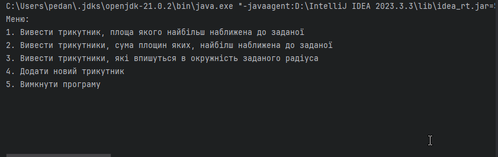

<h1 align="center">Лабораторна робота №4</h1>
<h2 align="center">Тема: Робота з джерелами даних в Java. Технологія JDBC</h2>
<h2 align="center">Виконав студент групи 6.1221</h2>
<h2 align="right">Федотов Євгеній Євгенійович</h2>
<h2 align="right">Варіант 13</h2>
<h3 align="center">Завдання </h3>

Организацию соединения с базой данных вынести в отдельный класс, метод которого возвращает соединение.
Создать БД. Привести таблицы к одной из нормированных форм.
Создать класс для выполнения запросов на извлечение информации из БД с использованием запросов.
Создать класс на добавление информации.
Создать меню (консольное приложение) для вызова соответствующего действия.
Результаты выполнения запроса выдать на консоль. 
 Треугольники. В БД хранятся треугольники и координаты их точек на плоскости.
 Вывести треугольник, площадь которого наиболее приближена к заданной.
 Вывести треугольники, сумма площадей которых наиболее приближена к заданной.
 Вывести треугольники, которые помещаются в окружность заданного радиуса.

<h3>Результат виконання роботи:</h3>

